# Complete AppArmor Profile Management Workflow
## From Zero-Day Deployment to Automated Fine-Tuning

**Document Version:** 1.1  
**Last Updated:** 2025-11-20  
**Target Environment:** Raspberry Pi production fleet with DEV mirror machine

---

## Table of Contents

1. [Overview](#overview)
2. [Visual Workflow Diagrams](#visual-workflow-diagrams)
3. [Phase 0: Zero-Day Deployment](#phase-0-zero-day-deployment)
4. [Phase 1: Regular OS Update Workflow](#phase-1-regular-os-update-workflow)
5. [Phase 2: Ad-Hoc/Emergency Update Workflow](#phase-2-ad-hoc-emergency-update-workflow)
6. [Phase 3: Auto-Finetuning Process](#phase-3-auto-finetuning-process)
7. [Tools and Components Reference](#tools-and-components-reference)
8. [Rollback Procedures](#rollback-procedures)
9. [Troubleshooting](#troubleshooting)

---

## Overview

This document describes the complete, automatic lifecycle of AppArmor profile management for Apache services running on Raspberry Pi devices. The workflow leverages a DEV machine (identical to production) for testing and profile fine-tuning before any changes reach production.

### Architecture

```
┌─────────────────┐      ┌──────────────────┐      ┌─────────────────────┐
│  Control Panel  │──────│  DEV Machine     │──────│  Production Fleet   │
│  (Ansible)      │      │  (Test Site)     │      │  (Multiple RPis)    │
└─────────────────┘      └──────────────────┘      └─────────────────────┘
```

### Key Principles

1. **DEV-First Testing**: All OS updates and profile changes are tested on DEV before production
2. **Automated Detection**: Changes are detected by comparing system baselines before/after updates
3. **Audit Mode**: AppArmor profiles use `aa-audit` mode for comprehensive logging during fine-tuning
4. **Human Approval**: Final deployment to production requires human approval
5. **Rollback Ready**: All profile changes are backed up for quick rollback if needed

---

## Visual Workflow Diagrams

This section provides comprehensive flowcharts for all workflow phases. These diagrams illustrate the complete automation lifecycle, decision points, and interactions between the Control Panel, DEV machine, and Production fleet.

### High-Level Overview: Complete Lifecycle


# End of Selection


### Actor Interaction Diagram

This diagram shows the interaction between different actors (Control Panel, DEV Machine, Production Fleet, and Human Operator) during a typical Phase 1 workflow:

```mermaid
sequenceDiagram
    actor Human as 👤 Human Operator
    participant CP as 💻 Control Panel
    participant DEV as 🔧 DEV Machine
    participant PROD as 🏭 Production Fleet

    Human->>CP: Start OS Update Process
    CP->>DEV: Prepare and test profile
    DEV-->>CP: Report results

    alt Approved
        CP->>PROD: Deploy profile and OS updates
        PROD-->>CP: Report status
    else Not Approved
        Human->>CP: Refine & Retry
    end

    Human->>CP: Test results are successful
    CP->>PROD: Deploy approved OS update and AppArmor profile
    PROD-->>CP: Report deployment status

```



---

---

## Phase 0: Zero-Day Deployment

### Objective
Set up the infrastructure and deploy initial AppArmor profiles to the production fleet from scratch.

### Phase 0: Zero-Day Deployment Workflow

```mermaid
graph TB
    Start([📦 Phase 0 Start:<br/>Zero-Day Deployment]) --> CheckReq{Prerequisites<br/>Met?}
    
    CheckReq -->|No| SetupReq[Setup Ansible,<br/>SSH Keys,<br/>Network Access]
    SetupReq --> CheckReq
    CheckReq -->|Yes| CloneRepo[Clone/Setup Project<br/>on Control Panel]
    
    CloneRepo --> ConfigInventory[Configure hosts<br/>Inventory File]
    ConfigInventory --> TestConn[Test Ansible<br/>Connectivity]
    
    TestConn -->|Failed| FixConn[Fix SSH/Network<br/>Issues]
    FixConn --> TestConn
    
    TestConn -->|Success| DeployInfra[Deploy Monitoring<br/>Infrastructure<br/>apparmor-deploy.yml]
    
    DeployInfra --> VerifyDeploy{Verify Scripts<br/>& Directories<br/>Deployed?}
    VerifyDeploy -->|No| FixDeploy[Check Playbook<br/>Errors]
    FixDeploy --> DeployInfra
    
    VerifyDeploy -->|Yes| CreateProdBaseline[Create Initial Baseline<br/>on Production Fleet<br/>task3-create-baseline.yml]
    
    CreateProdBaseline --> DeployProfile[Deploy Initial<br/>AppArmor Profile<br/>to Production]
    
    DeployProfile --> ReloadProfile[Reload Profile &<br/>Set to Enforce Mode]
    
    ReloadProfile --> TestProd{Test Production<br/>Apache?}
    TestProd -->|Failed| RollbackProfile[Rollback Profile<br/>Fix Issues]
    RollbackProfile --> DeployProfile
    
    TestProd -->|Success| SyncDev[Sync Profile<br/>to DEV Machine]
    
    SyncDev --> CreateDevBaseline[Create Initial Baseline<br/>on DEV Machine]
    
    CreateDevBaseline --> Complete([✅ Phase 0 Complete:<br/>Ready for Operations])
    
    style Start fill:#4CAF50,stroke:#2E7D32,color:#fff
    style Complete fill:#4CAF50,stroke:#2E7D32,color:#fff
    style DeployInfra fill:#2196F3,stroke:#1565C0,color:#fff
    style DeployProfile fill:#2196F3,stroke:#1565C0,color:#fff
    style TestProd fill:#FF9800,stroke:#E65100,color:#fff
    style CheckReq fill:#FF9800,stroke:#E65100,color:#fff
```



### Step 0.1: Initial Setup on Control Panel

**Location:** Control Panel

```bash
# 1. Clone or set up the project
cd /home/jimmyloi
git clone <repository-url> ansible_apparmor
cd ansible_apparmor

# 2. Configure inventory file
cat > hosts << 'INVENTORY'
[control]
localhost ansible_connection=local

[dev_machines]
dev-pi.local ansible_host=192.168.1.10 ansible_user=pi

[production]
prod-pi-01.local ansible_host=192.168.1.21 ansible_user=pi
prod-pi-02.local ansible_host=192.168.1.22 ansible_user=pi
prod-pi-03.local ansible_host=192.168.1.23 ansible_user=pi

[raspberry_pis:children]
dev_machines
production
INVENTORY

# 3. Test connectivity
ansible -i hosts all -m ping

# 4. Verify AppArmor is installed on all targets
ansible -i hosts raspberry_pis -b -m command -a "aa-status"
```

**Tools Used:**
- `ansible` (inventory management, connectivity testing)
- `git` (version control)

### Step 0.2: Deploy Baseline Monitoring Infrastructure

**Location:** Control Panel → All Raspberry Pis

```bash
# Deploy monitoring scripts and directory structure to all RPis
ansible-playbook -i hosts apparmor-deploy.yml

# What this does:
# - Creates /root/apache-monitor/ directory structure
# - Deploys baseline creation scripts
# - Deploys change detection scripts
# - Sets up log rotation
# - Creates backup directories for profiles
```

**Tools Used:**
- **Playbook:** `apparmor-deploy.yml`
- **Deployed Scripts:**
  - `scripts/create_baseline.sh` → `/root/apache-monitor/scripts/`
  - `scripts/detect_apache_changes.sh` → `/root/apache-monitor/scripts/`
  - `scripts/test_apache_functions.sh` → `/root/apache-monitor/scripts/`

**Verification:**

```bash
# Verify deployment
ansible -i hosts raspberry_pis -b -m command -a "ls -la /root/apache-monitor"

# Expected output: scripts/, data/baselines/, data/deltas/
```

### Step 0.3: Create Initial Baseline (Production State)

**Location:** Control Panel → Production Fleet

```bash
# Create initial baseline on ALL production machines (not DEV yet)
ansible-playbook -i hosts ansible/playbooks/task3-create-baseline.yml \
  -e "target_group=production" \
  -e "baseline_name=initial-production"

# What this captures:
# - Current Apache processes (PIDs, command lines, user/group)
# - Current file access patterns from AppArmor logs
# - Apache version
# - Timestamp
```

**Tools Used:**
- **Playbook:** `ansible/playbooks/task3-create-baseline.yml`
- **Backend Script:** `scripts/create_baseline.sh`

**Output:** JSON baseline files stored at:
- `/root/apache-monitor/data/baselines/initial-production-<timestamp>.json` (on each Pi)

**Verification:**

```bash
# Fetch baselines to control panel for review
ansible -i hosts production -b -m fetch \
  -a "src=/root/apache-monitor/data/baselines/initial-production-*.json dest=data/baselines/ flat=yes"

# Review baseline
cat data/baselines/initial-production-*.json | jq .
```

### Step 0.4: Deploy Initial AppArmor Profiles

**Location:** Control Panel → Production Fleet

```bash
# Deploy the initial profile (usually vendor-default or manually crafted)
ansible -i hosts production -b -m copy \
  -a "src=profiles/usr.sbin.apache2 dest=/etc/apparmor.d/usr.sbin.apache2 backup=yes"

# Reload profiles
ansible -i hosts production -b -m command \
  -a "apparmor_parser -r /etc/apparmor.d/usr.sbin.apache2"

# Set to enforce mode
ansible -i hosts production -b -m command \
  -a "aa-enforce /usr/sbin/apache2"

# Verify profile is loaded
ansible -i hosts production -b -m command \
  -a "aa-status | grep apache2"
```

**Tools Used:**
- `ansible` (ad-hoc commands)
- `apparmor_parser` (profile loading)
- `aa-enforce` (mode setting)

**Verification:**

```bash
# Check Apache is running normally
ansible -i hosts production -m uri \
  -a "url=http://{{ inventory_hostname }}/ return_content=no"

# Check AppArmor logs for denials (should be minimal/none)
ansible -i hosts production -b -m command \
  -a "grep DENIED /var/log/syslog | tail -20"
```

### Step 0.5: Configure DEV Machine

**Location:** Control Panel → DEV Machine

```bash
# Sync production state to DEV (copy profile, create baseline)
ansible -i hosts dev_machines -b -m copy \
  -a "src=profiles/usr.sbin.apache2 dest=/etc/apparmor.d/usr.sbin.apache2"

ansible -i hosts dev_machines -b -m command \
  -a "apparmor_parser -r /etc/apparmor.d/usr.sbin.apache2"

ansible -i hosts dev_machines -b -m command \
  -a "aa-enforce /usr/sbin/apache2"

# Create initial baseline on DEV
ansible-playbook -i hosts ansible/playbooks/task3-create-baseline.yml \
  -e "target_group=dev_machines" \
  -e "baseline_name=initial-dev"
```

**Tools Used:**
- Same as production setup
- **Purpose:** Ensure DEV mirrors production state exactly

---

## Phase 1: Regular OS Update Workflow

### Objective
Handle scheduled OS updates (e.g., monthly security patches) with automated profile fine-tuning.

### Workflow Overview

```
┌────────────────────────────────────────────────────────────────────┐
│                    REGULAR UPDATE WORKFLOW                         │
└────────────────────────────────────────────────────────────────────┘

1. [DEV] Create Pre-Update Baseline
2. [DEV] Perform OS Update
3. [DEV] Auto-Detect Changes & Generate Profile
4. [DEV] Apply & Test Profile (with aa-audit mode)
5. [HUMAN] Review & Approve
6. [PROD] Deploy Profile to Production
7. [PROD] Perform OS Update on Production
8. [PROD] Monitor & Finalize
```

### Phase 1: Regular OS Update Workflow (Main Workflow)


### Step 1.1: Pre-Update Baseline (DEV Only)

**Location:** Control Panel → DEV Machine

```bash
# Create baseline before OS update
ansible-playbook -i hosts ansible/playbooks/task3-create-baseline.yml \
  -e "target_group=dev_machines" \
  -e "baseline_name=pre-update-$(date +%Y%m%d)"
```

**Tools Used:**
- **Playbook:** `ansible/playbooks/task3-create-baseline.yml`
- **Script:** `scripts/create_baseline.sh`

**Output:** Baseline stored at `/root/apache-monitor/data/baselines/pre-update-YYYYMMDD-<timestamp>.json`

**Important:** This baseline captures the "known good" state before any changes.

### Step 1.2: Perform OS Update on DEV

**Location:** DEV Machine (manual or automated)

```bash
# SSH to DEV machine
ssh pi@dev-pi.local

# Perform OS update (Raspberry Pi OS)
sudo apt update
sudo apt upgrade -y
sudo apt autoremove -y

# Reboot if kernel updated
sudo reboot

# Wait for machine to come back online
# Verify Apache is running
curl http://localhost/
```

**Tools Used:**
- `apt` (package management)
- Manual verification

**Note:** Production machines do NOT update yet. They wait for profile validation.

### Step 1.3: Automated Fine-Tuning on DEV

**Location:** Control Panel → DEV Machine

This is the core automation step that combines multiple operations:

```bash
# Run the complete DEV fine-tuning workflow
ansible-playbook -i hosts ansible/playbooks/fine-tune-profile-dev.yml \
  -e "baseline_before=/root/apache-monitor/data/baselines/pre-update-20251120-*.json" \
  -e "create_post_update_baseline=yes" \
  -e "apply_suggestions=yes" \
  -e "run_tests=yes" \
  -e "audit_all_paths=true"

# What this does:
# 1. Creates post-update baseline (current state after OS update)
# 2. Detects changes (compares pre vs post baselines)
# 3. Generates profile suggestions (new paths, denied paths)
# 4. Applies suggestions to the profile
# 5. Toggles profile to aa-audit mode for comprehensive logging
# 6. Runs Apache functional tests (HTTP requests, file access, etc.)
# 7. Toggles profile back to aa-enforce mode
# 8. Generates summary report
```

**Tools Used:**
- **Playbook:** `ansible/playbooks/fine-tune-profile-dev.yml`
- **Scripts:**
  - `scripts/create_baseline.sh` (post-update baseline)
  - `scripts/detect_apache_changes.sh` (change detection)
  - `scripts/test_apache_functions.sh` (functional testing)
- **AppArmor Commands:**
  - `aa-audit /usr/sbin/apache2` (enable audit mode)
  - `aa-enforce /usr/sbin/apache2` (return to enforce mode)
- **Ansible Role:** `apparmor-profile` (backup, apply rules)

**Output Files:**
- `/root/apache-monitor/data/baselines/post-update-<timestamp>.json` (new baseline)
- `/root/apache-monitor/data/deltas/apache-delta-<timestamp>.json` (changes detected)
- `/root/apache-monitor/data/deltas/apparmor-profile-suggestions-<timestamp>.txt` (generated rules)
- Updated profile: `/etc/apparmor.d/usr.sbin.apache2` (on DEV)
- Test results in Ansible facts

**Verification:**

```bash
# Fetch results to control panel
ansible -i hosts dev_machines -b -m fetch \
  -a "src=/root/apache-monitor/data/deltas/apache-delta-* dest=data/deltas/ flat=yes"

# Review delta report
cat data/deltas/apache-delta-*.json | jq .

# Review profile suggestions
cat data/deltas/apparmor-profile-suggestions-*.txt

# Check test results from Ansible output
# Look for: "DEV testing: PASSED" or "DEV testing: FAILED"
```

**Iteration:** If tests fail, refine the profile:

```bash
# Option 1: Manual refinement
# Edit the profile on DEV, then re-run tests
ansible -i hosts dev_machines -b -m command \
  -a "/root/apache-monitor/scripts/test_apache_functions.sh"

# Option 2: Re-run fine-tuning without creating new baseline
ansible-playbook -i hosts ansible/playbooks/refine-profile-dev.yml \
  -e "apply_suggestions=yes" \
  -e "run_tests=yes"
```

### Step 1.4: Generate Approval Document

**Location:** Control Panel → DEV Machine → Control Panel

```bash
# Generate approval document with DEV test results
ansible-playbook -i hosts ansible/playbooks/task3-approve-profile-update.yml \
  -e "delta_file=/root/apache-monitor/data/deltas/apache-delta-<timestamp>.json" \
  -e "suggestions_file=/root/apache-monitor/data/deltas/apparmor-profile-suggestions-<timestamp>.txt" \
  -e "dev_test_passed=true" \
  -e "dev_test_output='All HTTP checks passed. Apache functioning normally.'"

# Fetch approval document
ansible -i hosts dev_machines -b -m fetch \
  -a "src=/root/apache-monitor/approvals/apache-approval-*.md dest=approvals/ flat=yes"
```

**Tools Used:**
- **Playbook:** `ansible/playbooks/task3-approve-profile-update.yml`
- **Script:** `scripts/create_approval_document.sh`

**Output:** Approval document at `approvals/apache-approval-<timestamp>.md`

**Approval Document Contains:**
- Delta summary (new paths, removed paths, denied paths)
- Profile suggestions
- DEV test results
- Version changes
- Human approval section (to be signed off)

### Step 1.5: Human Review and Approval

**Location:** Control Panel (human review)

```bash
# Review the approval document
cat approvals/apache-approval-<latest>.md

# Human decision points:
# - Are the detected changes expected? (e.g., new modules, log paths)
# - Did DEV tests pass?
# - Are there any security concerns with new paths?
# - Is the timing right for production deployment?

# If approved: proceed to Step 1.6
# If rejected: investigate unexpected changes, refine profile, repeat Step 1.3
```

**Tools Used:**
- Text editor / markdown viewer
- Human judgment

### Step 1.6: Deploy Profile to Production

**Location:** Control Panel → Production Fleet

```bash
# Deploy the tested profile from DEV to all production machines
ansible-playbook -i hosts ansible/playbooks/deploy-profile-to-production.yml \
  -e "source_host=dev-pi.local" \
  -e "profile_file=/etc/apparmor.d/usr.sbin.apache2"

# What this does:
# 1. Backs up current production profiles
# 2. Copies tested profile from DEV to production
# 3. Reloads profiles on production
# 4. Optionally enables aa-audit mode for monitoring period
# 5. Verifies Apache is still running
```

**Tools Used:**
- **Playbook:** `ansible/playbooks/deploy-profile-to-production.yml`
- **Ansible Modules:** `fetch`, `copy`, `command`
- **AppArmor Commands:** `apparmor_parser`, `aa-audit` (optional)

**Verification:**

```bash
# Verify profile is loaded on all production machines
ansible -i hosts production -b -m command \
  -a "aa-status | grep apache2"

# Verify Apache is running
ansible -i hosts production -m uri \
  -a "url=http://{{ inventory_hostname }}/ return_content=no"

# Check for immediate denials (should be none if DEV testing was thorough)
ansible -i hosts production -b -m command \
  -a "grep DENIED /var/log/syslog | grep apache2 | tail -5"
```

### Step 1.7: Perform OS Update on Production

**Location:** Production Fleet

Now that the profile is deployed and verified, production can be updated.

```bash
# Update production machines (rolling update recommended)
# Update one machine at a time or in batches

# Example: Update prod-pi-01
ansible -i hosts -l prod-pi-01.local production -b -m apt \
  -a "upgrade=dist update_cache=yes"

# Reboot if needed
ansible -i hosts -l prod-pi-01.local production -b -m reboot

# Wait for reboot and verify
ansible -i hosts -l prod-pi-01.local production -m ping

# Verify Apache and profile
ansible -i hosts -l prod-pi-01.local production -m uri \
  -a "url=http://{{ inventory_hostname }}/"

ansible -i hosts -l prod-pi-01.local production -b -m command \
  -a "aa-status | grep apache2"

# Repeat for remaining production machines
# Or use a rolling update strategy with Ansible serial parameter
```

**Tools Used:**
- `ansible` (ad-hoc commands or playbook with `serial` parameter)
- `apt` (package updates)

**Important:** Stagger updates. Don't update all production at once in case issues arise.

### Step 1.8: Monitor and Finalize

**Location:** Control Panel → Production Fleet

```bash
# Monitor AppArmor logs for denials over the next 24-72 hours
ansible -i hosts production -b -m command \
  -a "grep DENIED /var/log/syslog | grep apache2 | tail -20"

# If profile was in aa-audit mode, review logs for unexpected access
ansible -i hosts production -b -m command \
  -a "grep 'apparmor=\"AUDIT\"' /var/log/syslog | grep apache2 | tail -50"

# If no issues after monitoring period, finalize by ensuring enforce mode
ansible -i hosts production -b -m command \
  -a "aa-enforce /usr/sbin/apache2"

# Create post-production baseline for future comparison
ansible-playbook -i hosts ansible/playbooks/task3-create-baseline.yml \
  -e "target_group=production" \
  -e "baseline_name=post-update-$(date +%Y%m%d)"
```

**Tools Used:**
- `grep` (log analysis)
- `aa-enforce` (mode setting)
- Baseline creation playbook

---

## Phase 2: Ad-Hoc/Emergency Update Workflow

### Objective
Handle urgent security patches or critical updates that can't wait for the regular update cycle.

### Key Differences from Regular Workflow

1. **Speed Priority**: Automated testing is faster, human approval window is shorter
2. **Selective Updates**: May only affect specific packages, not full OS update
3. **Risk Assessment**: Higher urgency = more tolerance for minor issues
4. **Rollback Readiness**: Ensure rollback plan is ready before deployment

### Phase 2: Ad-Hoc/Emergency Update Workflow

```mermaid
graph TB
    Start([🚨 Phase 2 Start:<br/>Emergency Update]) --> Assess[Step 2.1: Emergency Assessment<br/>• Identify affected packages<br/>• Check Apache dependency<br/>• Assess urgency vs risk]
    
    Assess --> DevFirst{Can Test<br/>on DEV First?}
    
    DevFirst -->|No - Critical| DirectProd[⚠️ Direct to Production<br/>High Risk Path]
    DirectProd --> BackupAll[Backup All Profiles<br/>Take Snapshots]
    BackupAll --> UpdateProdEmerg[Apply Emergency Update<br/>First Machine Only]
    UpdateProdEmerg --> TestEmergProd
    
    DevFirst -->|Yes - Preferred| EmergBaseline[Step 2.2: Create Emergency<br/>Baseline on DEV]
    
    EmergBaseline --> FastUpdate[Apply Emergency Update<br/>on DEV<br/>apt install specific package]
    
    FastUpdate --> FastFineTune[Fast Fine-Tuning<br/>fine-tune-profile-dev.yml<br/>audit_all_paths=false<br/>Faster Detection]
    
    FastFineTune --> QuickReview[Quick Review Delta Report<br/>cat delta JSON]
    
    QuickReview --> DevTestEmerg{DEV Tests<br/>Passed?}
    
    DevTestEmerg -->|Failed| AssessFailure{Changes<br/>Significant?}
    AssessFailure -->|Yes| EscalateEmerg[Escalate Decision<br/>Consider Workaround]
    EscalateEmerg --> End([⛔ Emergency Aborted:<br/>Needs Further Analysis])
    
    AssessFailure -->|No - Minor| QuickFix[Quick Manual Fix]
    QuickFix --> DevTestEmerg
    
    DevTestEmerg -->|Passed| DeployEmergProd[Step 2.3: Deploy to Production<br/>deploy-profile-to-production.yml]
    
    DeployEmergProd --> UpdateProdEmerg
    
    UpdateProdEmerg --> TestEmergProd{First Machine<br/>Stable?}
    
    TestEmergProd -->|No| RollbackEmerg[Immediate Rollback<br/>Profile + Package]
    RollbackEmerg --> EscalateEmerg
    
    TestEmergProd -->|Yes| ContinueRollout{Continue to<br/>Other Machines?}
    
    ContinueRollout -->|Yes| UpdateNextMachine[Update Next Machine<br/>serial=1 Controlled Rollout]
    UpdateNextMachine --> AllDone{All Machines<br/>Updated?}
    
    AllDone -->|No| UpdateNextMachine
    AllDone -->|Yes| IntensiveMonitor
    
    ContinueRollout -->|Monitor First| IntensiveMonitor[Step 2.4: Intensive Monitoring<br/>Check every 15 min<br/>for 1-2 hours]
    
    IntensiveMonitor --> StableCheck{Production<br/>Stable?}
    
    StableCheck -->|Issues| RollbackEmerg
    StableCheck -->|Stable 1-2h| ReduceMonitor[Reduce to Normal<br/>Monitoring Schedule]
    
    ReduceMonitor --> FinalCheck[Continue Monitoring<br/>24 Hours]
    
    FinalCheck --> CompleteEmerg([✅ Phase 2 Complete:<br/>Emergency Update Deployed])
    
    style Start fill:#F44336,stroke:#C62828,color:#fff
    style CompleteEmerg fill:#4CAF50,stroke:#2E7D32,color:#fff
    style End fill:#9E9E9E,stroke:#616161,color:#fff
    style DirectProd fill:#FF5722,stroke:#D84315,color:#fff
    style EscalateEmerg fill:#FF5722,stroke:#D84315,color:#fff
    style DevTestEmerg fill:#FF9800,stroke:#E65100,color:#fff
    style TestEmergProd fill:#FF9800,stroke:#E65100,color:#fff
    style IntensiveMonitor fill:#FFC107,stroke:#F57C00,color:#000
```




### Step 2.1: Emergency Assessment

**Location:** Control Panel

```bash
# 1. Assess the emergency update scope
# Questions:
# - What packages are affected?
# - Does it affect Apache or its dependencies?
# - Can we test on DEV first or must we go direct to production?

# 2. Check current production state
ansible -i hosts production -b -m command \
  -a "dpkg -l | grep <affected-package>"

ansible -i hosts production -b -m command \
  -a "systemctl status apache2"
```

### Step 2.2: Fast-Track DEV Testing

**Location:** Control Panel → DEV Machine

```bash
# Create emergency baseline
ansible-playbook -i hosts ansible/playbooks/task3-create-baseline.yml \
  -e "target_group=dev_machines" \
  -e "baseline_name=emergency-$(date +%Y%m%d-%H%M%S)"

# Apply emergency update on DEV
ansible -i hosts dev_machines -b -m apt \
  -a "name=<package-name> state=latest update_cache=yes"

# Run fast fine-tuning (skip some optional steps)
ansible-playbook -i hosts ansible/playbooks/fine-tune-profile-dev.yml \
  -e "baseline_before=/root/apache-monitor/data/baselines/emergency-*.json" \
  -e "create_post_update_baseline=yes" \
  -e "apply_suggestions=yes" \
  -e "run_tests=yes" \
  -e "audit_all_paths=false"  # Faster: only audit system paths

# Quick review of results
ansible -i hosts dev_machines -b -m fetch \
  -a "src=/root/apache-monitor/data/deltas/apache-delta-* dest=data/deltas/ flat=yes"

cat data/deltas/apache-delta-*.json | jq .
```

**Decision Point:**

- **If DEV tests pass and changes are minimal:** Proceed to emergency deployment
- **If DEV tests fail or changes are significant:** Escalate, consider workarounds

### Step 2.3: Emergency Deployment to Production

**Location:** Control Panel → Production Fleet

```bash
# Deploy profile to production
ansible-playbook -i hosts ansible/playbooks/deploy-profile-to-production.yml \
  -e "source_host=dev-pi.local" \
  -e "profile_file=/etc/apparmor.d/usr.sbin.apache2"

# Apply emergency update to production (one machine at a time)
ansible -i hosts -l prod-pi-01.local production -b -m apt \
  -a "name=<package-name> state=latest update_cache=yes"

# Immediate verification
ansible -i hosts -l prod-pi-01.local production -m uri \
  -a "url=http://{{ inventory_hostname }}/"

ansible -i hosts -l prod-pi-01.local production -b -m command \
  -a "systemctl status apache2"

# If successful on first machine, continue to others
# Use serial=1 for controlled rollout
```

**Rollback Command (if needed):**

```bash
# Restore previous profile from backup
ansible -i hosts production -b -m copy \
  -a "src=/etc/apparmor.d/backups/usr.sbin.apache2.<timestamp> dest=/etc/apparmor.d/usr.sbin.apache2 remote_src=yes"

ansible -i hosts production -b -m command \
  -a "apparmor_parser -r /etc/apparmor.d/usr.sbin.apache2"

# Downgrade package if needed
ansible -i hosts production -b -m apt \
  -a "name=<package-name>=<previous-version> allow_downgrade=yes"
```

### Step 2.4: Intensive Monitoring

**Location:** Control Panel → Production Fleet

```bash
# Monitor logs every 15 minutes for the first hour
watch -n 900 'ansible -i hosts production -b -m command -a "grep -E \"DENIED|ERROR\" /var/log/syslog | grep apache2 | tail -10"'

# Check Apache access logs for errors
ansible -i hosts production -b -m command \
  -a "tail -20 /var/log/apache2/error.log"

# If stable after 1-2 hours, reduce monitoring to normal schedule
```

---

## Phase 3: Auto-Finetuning Process

### Objective
Continuous refinement of AppArmor profiles based on observed behavior, even outside of update cycles.


### Phase 3: Auto-Finetuning Process

```mermaid
graph TB
    Start([🔄 Phase 3 Start:<br/>Auto-Finetuning]) --> SetupMonitor[Step 3.1: Setup Continuous<br/>Monitoring<br/>• Create daily_monitor.sh<br/>• Add to crontab<br/>• Configure alerts]
    
    SetupMonitor --> DailyRun[Daily Cron Job Runs<br/>Collect Denial Logs]
    
    DailyRun --> CheckDenials{Denials<br/>Detected?}
    
    CheckDenials -->|No| WaitNext[Wait for Next Day]
    WaitNext --> DailyRun
    
    CheckDenials -->|Yes| SendAlert[Send Email Alert<br/>to Admin]
    
    SendAlert --> AnalyzeDenials[Step 3.2: Analyze Denials<br/>• Parse logs<br/>• Group by path/type<br/>• Identify patterns]
    
    AnalyzeDenials --> Categorize{Step 3.2: Categorize<br/>Denials}
    
    Categorize -->|Expected - New Feature| ValidChange[Valid Application<br/>Change]
    Categorize -->|Unexpected| InvestigateSecurity[Investigate Potential<br/>Security Issue]
    Categorize -->|Noise/False Positive| TuneApp[Tune Application<br/>or Adjust Profile Logic]
    
    InvestigateSecurity --> SecThreat{Security<br/>Threat?}
    SecThreat -->|Yes| IncidentResponse[Trigger Incident<br/>Response]
    SecThreat -->|No| ValidChange
    
    ValidChange --> ReplicateDev[Step 3.3: Replicate on DEV<br/>• Deploy same app change<br/>• Or create test scenario]
    
    ReplicateDev --> CreateAutoBaseline[Create Pre-Change<br/>Baseline on DEV<br/>task3-create-baseline.yml]
    
    CreateAutoBaseline --> ApplyChange[Apply Application Change<br/>on DEV]
    
    ApplyChange --> AutoFineTune[Run Fine-Tuning<br/>fine-tune-profile-dev.yml<br/>audit_all_paths=true]
    
    AutoFineTune --> IterativeTest[Step 3.4: Iterative Testing<br/>• Enable aa-audit<br/>• Run comprehensive tests<br/>• Check for denials]
    
    IterativeTest --> TestResult{Tests Clean?<br/>No Denials?}
    
    TestResult -->|Denials Found| AnalyzeNewDenials[Analyze New Denials]
    AnalyzeNewDenials --> AddToProfile{Add to<br/>Profile?}
    
    AddToProfile -->|Yes| UpdateProfileDev[Update Profile on DEV<br/>Apply new rules]
    UpdateProfileDev --> IterativeTest
    
    AddToProfile -->|No - App Issue| FixApp[Fix Application<br/>Behavior]
    FixApp --> IterativeTest
    
    TestResult -->|Clean| DeployRefined[Step 3.5: Deploy Refined<br/>Profile to Production<br/>deploy-profile-to-production.yml]
    
    DeployRefined --> EnableProdAudit[Enable aa-audit Mode<br/>on Production<br/>Optional Monitoring Period]
    
    EnableProdAudit --> MonitorAuto[Monitor Production<br/>24-48 Hours]
    
    MonitorAuto --> ProdClean{Production<br/>Clean?}
    
    ProdClean -->|Issues| MinorProdIssue{Minor or<br/>Critical?}
    MinorProdIssue -->|Critical| RollbackAuto[Rollback Profile]
    RollbackAuto --> InvestigateSecurity
    
    MinorProdIssue -->|Minor| TweakProfile[Tweak Profile on DEV<br/>Redeploy]
    TweakProfile --> DeployRefined
    
    ProdClean -->|Clean| FinalizeAuto[Finalize: Set to<br/>aa-enforce Mode]
    
    FinalizeAuto --> DocumentChange[Document Change<br/>Update Baseline]
    
    DocumentChange --> CompleteAuto([✅ Phase 3 Complete:<br/>Profile Refined])
    
    CompleteAuto --> DailyRun
    
    IncidentResponse --> EndIncident([🛑 Incident Response<br/>Follow Security Procedures])
    TuneApp --> DailyRun
    
    style Start fill:#00BCD4,stroke:#00838F,color:#fff
    style CompleteAuto fill:#4CAF50,stroke:#2E7D32,color:#fff
    style DailyRun fill:#FFC107,stroke:#F57C00,color:#000
    style CheckDenials fill:#FF9800,stroke:#E65100,color:#fff
    style Categorize fill:#FF9800,stroke:#E65100,color:#fff
    style SecThreat fill:#FF9800,stroke:#E65100,color:#fff
    style IncidentResponse fill:#F44336,stroke:#C62828,color:#fff
    style EndIncident fill:#F44336,stroke:#C62828,color:#fff
    style IterativeTest fill:#2196F3,stroke:#1565C0,color:#fff
```




### When to Use Auto-Finetuning

1. **New Application Features**: When developers deploy new web applications
2. **Configuration Changes**: When Apache configuration changes (new modules, vhosts)
3. **Behavioral Drift**: When legitimate application behavior triggers denials
4. **Periodic Review**: Quarterly reviews of AppArmor logs for optimization

### Step 3.1: Continuous Monitoring

**Location:** Control Panel → Production Fleet

```bash
# Set up periodic log collection (e.g., daily cron job)
# Create a script on control panel: /home/jimmyloi/ansible_apparmor/scripts/daily_monitor.sh

#!/bin/bash
DATE=$(date +%Y%m%d)
ansible -i /home/jimmyloi/ansible_apparmor/hosts production -b \
  -m command -a "grep DENIED /var/log/syslog | grep apache2" \
  > /home/jimmyloi/ansible_apparmor/monitoring/denials-$DATE.log

# Alert if denials are found
if [ -s /home/jimmyloi/ansible_apparmor/monitoring/denials-$DATE.log ]; then
  echo "AppArmor denials detected on $DATE" | mail -s "AppArmor Alert" admin@example.com
fi

# Add to crontab
crontab -e
# Add: 0 2 * * * /home/jimmyloi/ansible_apparmor/scripts/daily_monitor.sh
```

**Tools Used:**
- `cron` (scheduling)
- `grep` (log parsing)
- `mail` (alerting)

### Step 3.2: Analyze Denials

**Location:** Control Panel

```bash
# Review collected denials
cat monitoring/denials-*.log | grep DENIED | sort | uniq -c | sort -rn

# Common patterns to look for:
# - New file paths being accessed
# - Permission denials (read vs write)
# - Network operations
# - Capability requirements

# Categorize denials:
# - Expected (new features) → add to profile
# - Unexpected (potential attack) → investigate further
# - Noise (false positives) → refine profile or adjust application
```

**Tools Used:**
- Text processing (`grep`, `sort`, `uniq`, `awk`)
- Log analysis

### Step 3.3: Replicate on DEV

**Location:** Control Panel → DEV Machine

```bash
# Replicate the production scenario on DEV
# Example: If new web application was deployed, deploy it to DEV too

# Create pre-change baseline
ansible-playbook -i hosts ansible/playbooks/task3-create-baseline.yml \
  -e "target_group=dev_machines" \
  -e "baseline_name=auto-tune-before-$(date +%Y%m%d)"

# Deploy the application/configuration change to DEV
# (this is application-specific)

# Create post-change baseline and detect
ansible-playbook -i hosts ansible/playbooks/fine-tune-profile-dev.yml \
  -e "baseline_before=/root/apache-monitor/data/baselines/auto-tune-before-*.json" \
  -e "create_post_update_baseline=yes" \
  -e "apply_suggestions=yes" \
  -e "run_tests=yes" \
  -e "audit_all_paths=true"
```

**Tools Used:**
- Same as regular update workflow
- Application deployment tools (depends on your app)

### Step 3.4: Iterative Testing

**Location:** DEV Machine

```bash
# Test the application thoroughly on DEV
# Include edge cases and stress testing

# Monitor AppArmor logs during testing
ansible -i hosts dev_machines -b -m command \
  -a "aa-audit /usr/sbin/apache2"

# Run application-specific tests
ansible -i hosts dev_machines -m command \
  -a "/root/apache-monitor/scripts/test_apache_functions.sh"

# Review any remaining denials
ansible -i hosts dev_machines -b -m command \
  -a "grep DENIED /var/log/syslog | grep apache2"

# If denials found, analyze and add to profile manually or re-run detection
```

**Iteration Loop:**

```
Test → Detect Denials → Update Profile → Test → Repeat until no denials
```

### Step 3.5: Deploy Refined Profile

**Location:** Control Panel → Production Fleet

```bash
# Once DEV testing is clean, deploy to production
ansible-playbook -i hosts ansible/playbooks/deploy-profile-to-production.yml \
  -e "source_host=dev-pi.local" \
  -e "profile_file=/etc/apparmor.d/usr.sbin.apache2"

# Enable audit mode on production for monitoring period (optional)
ansible -i hosts production -b -m command \
  -a "aa-audit /usr/sbin/apache2"

# After 24-48 hours, if stable, return to enforce mode
ansible -i hosts production -b -m command \
  -a "aa-enforce /usr/sbin/apache2"
```

---

## Tools and Components Reference

### Ansible Playbooks

| Playbook | Purpose | Key Parameters |
|----------|---------|----------------|
| `apparmor-deploy.yml` | Deploy monitoring infrastructure | None |
| `task3-create-baseline.yml` | Create system baseline snapshot | `target_group`, `baseline_name` |
| `fine-tune-profile-dev.yml` | Complete DEV fine-tuning workflow | `baseline_before`, `create_post_update_baseline`, `apply_suggestions`, `run_tests`, `audit_all_paths` |
| `task3-detect-changes.yml` | Standalone change detection | `baseline_before`, `baseline_after`, `output_format` |
| `task3-approve-profile-update.yml` | Generate approval document | `delta_file`, `suggestions_file`, `dev_test_passed` |
| `deploy-profile-to-production.yml` | Deploy profile to production | `source_host`, `profile_file` |
| `apparmor-dev-to-prod-workflow.yml` | Master orchestration workflow | Combines multiple playbooks |

### Shell Scripts

| Script | Location | Purpose | Key Options |
|--------|----------|---------|-------------|
| `create_baseline.sh` | `/root/apache-monitor/scripts/` (on RPi) | Capture system state | `--name`, `--profile` |
| `detect_apache_changes.sh` | `/root/apache-monitor/scripts/` (on RPi) | Compare baselines | `--audit-all-paths`, `--audit-system-paths`, `--output-profile-only`, `--profile-format` |
| `test_apache_functions.sh` | `/root/apache-monitor/scripts/` (on RPi) | Test Apache functionality | None (self-contained) |
| `create_approval_document.sh` | `/root/apache-monitor/scripts/` (on RPi) | Generate approval doc | `--delta`, `--suggestions`, `--dev-test-passed` |

### Ansible Roles

| Role | Purpose | Key Tasks |
|------|---------|-----------|
| `apparmor-profile` | Profile management | `backup-profile.yml`, `apply-profile.yml` |

### AppArmor Commands

| Command | Purpose | When to Use |
|---------|---------|-------------|
| `aa-status` | Check profile status | Verification after any change |
| `aa-enforce <profile>` | Set profile to enforce mode | After testing is complete |
| `aa-audit <profile>` | Set profile to audit mode | During testing/monitoring periods |
| `aa-complain <profile>` | Set profile to complain mode | Rarely used (logs only, no enforcement) |
| `apparmor_parser -r <file>` | Reload profile | After editing profile file |

### Key File Locations

**On Raspberry Pi (DEV and Production):**

```
/etc/apparmor.d/
├── usr.sbin.apache2                    # Main AppArmor profile
└── backups/
    └── usr.sbin.apache2.<timestamp>    # Automatic backups

/root/apache-monitor/
├── scripts/
│   ├── create_baseline.sh
│   ├── detect_apache_changes.sh
│   └── test_apache_functions.sh
├── data/
│   ├── baselines/
│   │   ├── pre-update-<timestamp>.json
│   │   └── post-update-<timestamp>.json
│   └── deltas/
│       ├── apache-delta-<timestamp>.json
│       ├── apache-delta-<timestamp>.txt
│       └── apparmor-profile-suggestions-<timestamp>.txt
└── approvals/
    └── apache-approval-<timestamp>.md

/var/log/
├── syslog                              # AppArmor DENIED/AUDIT logs
└── apache2/
    ├── access.log
    └── error.log
```

**On Control Panel:**

```
/home/jimmyloi/ansible_apparmor/
├── hosts                               # Ansible inventory
├── ansible/
│   ├── playbooks/                      # All playbooks
│   └── roles/                          # Ansible roles
├── scripts/                            # Helper scripts
├── profiles/                           # Master profile templates
├── data/
│   ├── baselines/                      # Fetched baselines
│   └── deltas/                         # Fetched delta reports
├── approvals/                          # Approval documents
└── monitoring/                         # Daily monitoring logs
```

---

## Rollback Procedures

### Scenario 1: Profile Causes Apache Failure

**Symptoms:**
- Apache won't start
- Apache is running but non-functional
- Critical denials in logs

**Immediate Rollback:**

```bash
# On affected machine(s)
ssh pi@<affected-host>

# Find latest backup
ls -lt /etc/apparmor.d/backups/usr.sbin.apache2.*

# Restore backup
sudo cp /etc/apparmor.d/backups/usr.sbin.apache2.<timestamp> \
        /etc/apparmor.d/usr.sbin.apache2

# Reload profile
sudo apparmor_parser -r /etc/apparmor.d/usr.sbin.apache2

# Restart Apache
sudo systemctl restart apache2

# Verify
curl http://localhost/
```

**Automated Rollback from Control Panel:**

```bash
# Rollback all production machines
ansible -i hosts production -b -m copy \
  -a "src=/etc/apparmor.d/backups/usr.sbin.apache2.<timestamp> \
      dest=/etc/apparmor.d/usr.sbin.apache2 \
      remote_src=yes"

ansible -i hosts production -b -m command \
  -a "apparmor_parser -r /etc/apparmor.d/usr.sbin.apache2"

ansible -i hosts production -b -m systemd \
  -a "name=apache2 state=restarted"
```

### Scenario 2: OS Update Causes System Instability

**Symptoms:**
- System performance degradation
- Unexpected service failures
- Kernel issues

**Rollback Steps:**

```bash
# List installed packages and their previous versions
ssh pi@<affected-host>
dpkg -l | grep ^ii

# Downgrade specific package
sudo apt install <package-name>=<previous-version> --allow-downgrades

# Or: Full system snapshot rollback (if using LVM snapshots or similar)
# This is system-specific and depends on your backup strategy
```

**Prevention:** Always test OS updates on DEV first. Never update production until DEV is verified stable for 24+ hours.

### Scenario 3: Profile Deployed but Has Minor Issues

**Symptoms:**
- Most functionality works
- Some specific features are blocked
- Non-critical denials in logs

**Mitigation (Temporary):**

```bash
# Switch to audit mode (allows everything, logs all access)
ansible -i hosts production -b -m command \
  -a "aa-audit /usr/sbin/apache2"

# Monitor for 24 hours to gather data
# Then fix profile on DEV and redeploy
```

---

## Troubleshooting

### Issue: Baseline creation hangs or fails

**Symptoms:**
- `create_baseline.sh` script doesn't complete
- JSON file is empty or malformed

**Diagnosis:**

```bash
# Check if Apache is running
ansible -i hosts <target> -b -m command -a "systemctl status apache2"

# Run baseline script manually with debug
ansible -i hosts <target> -b -m command \
  -a "/root/apache-monitor/scripts/create_baseline.sh --name debug --profile /usr/sbin/apache2"

# Check for file system issues
ansible -i hosts <target> -b -m command -a "df -h"
ansible -i hosts <target> -b -m command -a "ls -la /root/apache-monitor/data/baselines/"
```

**Solutions:**
- Ensure `/root/apache-monitor/` has sufficient space
- Verify AppArmor is running: `aa-status`
- Check syslog for AppArmor messages: `grep apparmor /var/log/syslog`

### Issue: Change detection finds no changes

**Symptoms:**
- Delta report shows all zeros
- No suggestions generated

**Diagnosis:**

```bash
# Verify baseline files exist and are valid JSON
ansible -i hosts dev_machines -b -m command \
  -a "cat /root/apache-monitor/data/baselines/pre-update-*.json | jq ."

ansible -i hosts dev_machines -b -m command \
  -a "cat /root/apache-monitor/data/baselines/post-update-*.json | jq ."

# Check if Apache was actually using new paths
ansible -i hosts dev_machines -b -m command \
  -a "grep apache2 /var/log/syslog | tail -50"
```

**Solutions:**
- Ensure Apache was actively used between baselines (run test requests)
- Verify AppArmor logging is enabled
- Check if post-update baseline captured enough activity (may need to wait longer)

### Issue: Profile syntax errors after applying suggestions

**Symptoms:**
- `apparmor_parser` fails with syntax error
- Profile won't reload

**Diagnosis:**

```bash
# Test profile syntax manually
ansible -i hosts <target> -b -m command \
  -a "apparmor_parser -QT /etc/apparmor.d/usr.sbin.apache2"

# Check profile contents
ansible -i hosts <target> -b -m command \
  -a "cat /etc/apparmor.d/usr.sbin.apache2"
```

**Common Issues:**
- **Duplicate rules**: Clean up with `sort | uniq`
- **Invalid characters**: Check for special chars in paths
- **Mismatched braces**: Ensure profile has proper `{ }` structure
- **Unsupported `audit` keyword**: Older AppArmor versions don't support `audit` qualifier on allow rules

**Solutions:**

```bash
# Clean up profile manually
ansible -i hosts <target> -b -m command \
  -a "sed -i 's/^audit //' /etc/apparmor.d/usr.sbin.apache2"

# Or restore backup and re-apply suggestions with corrections
ansible -i hosts <target> -b -m copy \
  -a "src=/etc/apparmor.d/backups/usr.sbin.apache2.<timestamp> \
      dest=/etc/apparmor.d/usr.sbin.apache2 \
      remote_src=yes"
```

### Issue: aa-audit or aa-enforce commands fail

**Symptoms:**
- Error: `ERROR: Cannot find <profile> in /etc/apparmor.d`
- Or: Profile name mismatch

**Diagnosis:**

```bash
# Check profile name vs file path
ansible -i hosts <target> -b -m command -a "aa-status"

# List profiles in enforce mode vs complain mode
ansible -i hosts <target> -b -m command -a "aa-status | grep -A 20 'profiles are loaded'"
```

**Solutions:**
- Ensure profile name matches binary path: `/usr/sbin/apache2`
- Check symlinks: `/usr/sbin/apache2` should be the actual binary or canonical path
- Verify profile file exists: `/etc/apparmor.d/usr.sbin.apache2`

### Issue: DEV tests pass but production has denials

**Symptoms:**
- DEV environment shows no issues
- Production immediately has DENIED logs

**Diagnosis:**

```bash
# Compare configurations
# DEV:
ansible -i hosts dev_machines -b -m command -a "apache2 -V"
ansible -i hosts dev_machines -b -m command -a "ls -la /etc/apache2/sites-enabled/"

# Production:
ansible -i hosts production -b -m command -a "apache2 -V"
ansible -i hosts production -b -m command -a "ls -la /etc/apache2/sites-enabled/"

# Check for environment differences
# - Different loaded modules
# - Different virtual hosts
# - Different file paths (symlinks, mounts)
```

**Solutions:**
- Ensure DEV truly mirrors production (configuration, workload, modules)
- Run more comprehensive tests on DEV (cover all production use cases)
- Consider environment-specific profile variants if necessary

### Issue: Ansible playbook fails with "recursive loop detected"

**Symptoms:**
- Playbook aborts with templating error
- Variable references itself

**Diagnosis:**

```bash
# Check playbook for circular variable definitions
grep -n "{{ variable_name }}" ansible/playbooks/<playbook>.yml
```

**Solutions:**
- Use intermediate variables to break recursion
- Ensure `default()` filters don't reference the variable being defined
- Example fix: Use `_data` suffix for decoded content, then set main variable from it

---

# AppArmor Profile Management - Visual Flowcharts

## High-Level System Overview


---

# AppArmor Profile Management - Visual Flowcharts

## High-Level System Overview


---

## Phase 0: Zero-Day Deployment


---

## Phase 1: Regular OS Update Workflow


---

## Phase 2: Emergency Update Workflow


---

## Phase 3: Auto-Finetuning Process


---

## Rollback Decision Tree


---

## Tools and Components Interaction


---

## Workflow Selection Decision Matrix


---

## Timeline Visualization (Regular Update)

```mermaid
gantt
    title AppArmor Profile Management - Regular Update Timeline
    dateFormat HH:mm
    axisFormat %H:%M
    
    section Phase 0 One-Time
    Setup Control Panel           :done, setup, 00:00, 30m
    Deploy Infrastructure         :done, deploy, after setup, 30m
    Initial Production Baselines  :done, initbase, after deploy, 20m
    Deploy Initial Profiles       :done, initprof, after initbase, 20m
    Configure DEV Machine         :done, devsetup, after initprof, 30m
    
    section Phase 1 Regular Update
    Pre-Update Baseline DEV       :active, prebase, 00:00, 10m
    OS Update on DEV              :osupdate, after prebase, 30m
    Post-Update Baseline          :postbase, after osupdate, 10m
    Detect Changes                :detect, after postbase, 5m
    Generate Suggestions          :suggest, after detect, 5m
    Apply to Profile              :apply, after suggest, 5m
    Enable aa-audit Mode          :audit, after apply, 2m
    Run Functional Tests          :test, after audit, 15m
    Disable aa-audit Mode         :enforce, after test, 2m
    Generate Approval Doc         :approval, after enforce, 5m
    Human Review                  :crit, review, after approval, 1h
    Deploy to Production          :prod, after review, 15m
    OS Update Production Serial   :produpdate, after prod, 2h
    Monitor Production            :monitor, after produpdate, 24h
    
    section Phase 2 Emergency
    Emergency Assessment          :emerg1, 00:00, 15m
    Fast DEV Testing              :emerg2, after emerg1, 30m
    Quick Approval                :crit, emerg3, after emerg2, 15m
    Canary Deployment             :emerg4, after emerg3, 30m
    Rolling Emergency Update      :emerg5, after emerg4, 1h
    Intensive Monitoring          :crit, emerg6, after emerg5, 2h
```




## Summary Checklist

### Zero-Day Deployment
- [ ] Control panel set up with Ansible
- [ ] Inventory file configured
- [ ] SSH access to all machines verified
- [ ] Monitoring infrastructure deployed (`apparmor-deploy.yml`)
- [ ] Initial baselines created on production
- [ ] Initial profiles deployed to production
- [ ] DEV machine synced with production state

### Regular Update Workflow
- [ ] Pre-update baseline created on DEV
- [ ] OS update performed on DEV
- [ ] Fine-tuning completed on DEV (`fine-tune-profile-dev.yml`)
- [ ] DEV tests passed
- [ ] Approval document generated and reviewed
- [ ] Human approval obtained
- [ ] Profile deployed to production
- [ ] OS update performed on production
- [ ] Post-update monitoring completed (24-72 hours)
- [ ] Final baseline created

### Ad-Hoc Update Workflow
- [ ] Emergency assessed and justified
- [ ] DEV fast-track testing completed
- [ ] Profile deployed to production
- [ ] Emergency update applied to production (rolling)
- [ ] Intensive monitoring for first 1-2 hours
- [ ] Continued monitoring for 24 hours

### Auto-Finetuning
- [ ] Continuous monitoring configured (daily cron)
- [ ] Denials analyzed and categorized
- [ ] Change replicated on DEV
- [ ] Iterative testing completed
- [ ] Refined profile deployed to production
- [ ] Monitoring period completed

---

**End of Document**

For questions or issues not covered in this document, consult:
- `docs/WORK_SUMMARY.md` - Technical implementation details
- `docs/WORK_NEXT_STEPS.md` - Future enhancements
- `scripts/README.md` - Script-specific documentation
